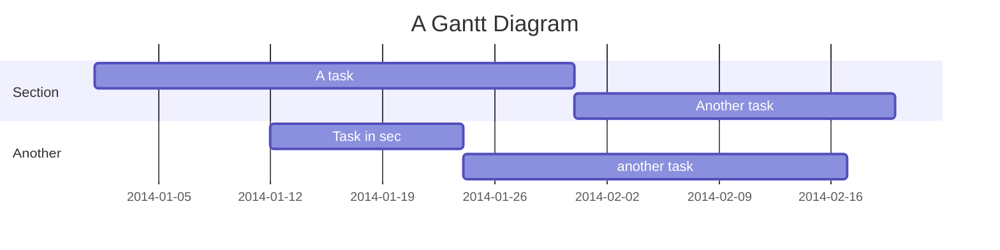
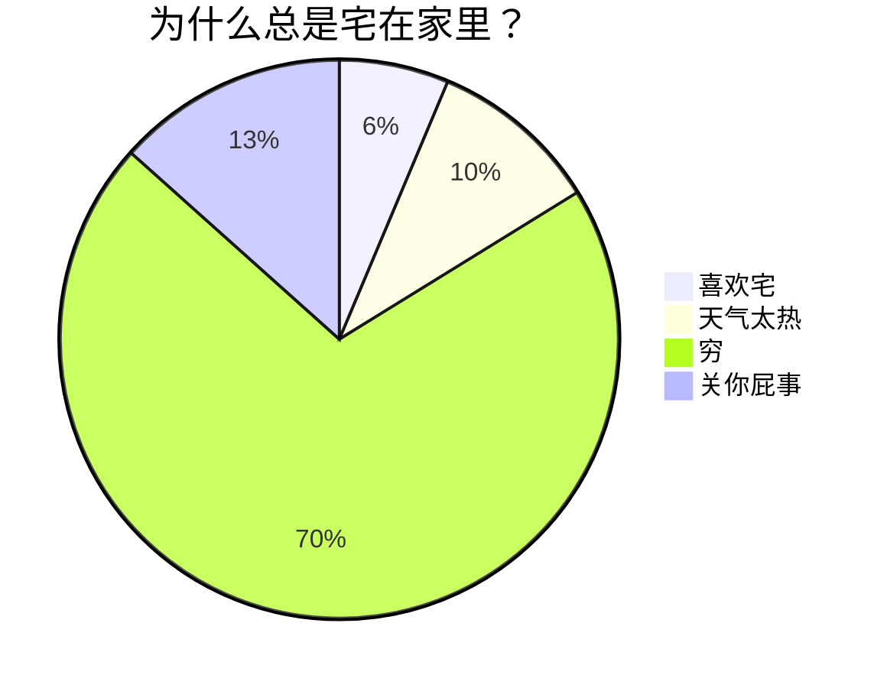

### 1. **内部链接（双链）**

- **链接到其他笔记**：使用 `[[笔记名称]]` 创建指向其他笔记的链接4。
- **链接到特定标题**：使用 `[[笔记名称#标题]]` 链接到其他笔记中的特定标题9。
- **链接到特定内容块**：使用 `[[笔记名称^块ID]]` 链接到其他笔记中的特定内容块9。

### 2. **嵌入笔记**

- **嵌入整个笔记**：使用 `![[笔记名称]]` 将其他笔记的内容嵌入到当前笔记中9。
- **嵌入特定标题**：使用 `![[笔记名称#标题]]` 嵌入其他笔记中的特定标题内容9。
- **嵌入特定内容块**：使用 `![[笔记名称^块ID]]` 嵌入其他笔记中的特定内容块9。
	- [[进阶#2. **嵌入笔记**]] 
	- [[进阶#^681a97]]

### 3. **数学公式**

- **行内数学公式**：使用 `$数学公式$` 插入行内数学公式，例如 $E=mc^2$。
- **块级数学公式**：使用 `$$数学公式$$` 插入块级数学公式，例如：
	∫abf(x) dx=F(b)−F(a)


### 4. **Mermaid 图表**
- **流程图**：使用 Mermaid 语法创建流程图，例如：
```mermaid
graph TD;
    A-->B;
    A-->C;
    B-->D;
    C-->D;
````


```mermaid
graph LR
emperor((朱八八))-.子.->朱五四-.子.->朱四九-.子.->朱百六
朱雄英--长子-->朱标--长子-->emperor
emperor2((朱允炆))--次子-->朱标
朱樉--次子-->emperor
朱棡--三子-->emperor
emperor3((朱棣))--四子-->emperor
emperor4((朱高炽))--长子-->emperor3
```

- **时序图**：使用 Mermaid 语法创建时序图，例如：

    ```mermaid
    sequenceDiagram
        participant Alice
        participant Bob
        Alice->>Bob: Hello Bob, how are you?
        Bob-->>Alice: Not too bad, thanks for asking.
    ```


```            

```


### 5. **Callout 模块**

- **创建 Callout**：使用 `[!类型]` 创建 Callout 模块，例如 `[!INFO]`、`[!WARNING]` 等4。
- **自定义 Callout**：可以自定义 Callout 的标题和图标，例如 `[!TIP] 这是小提示`4。

### 6. **表格**

- **创建表格**：使用 `|` 分隔列，使用 `-` 定义表头，例如：

| 姓名  | 年龄  | 成绩  |
| --- | --- | --- |
| 张三  | 21  | 98  |
| 李四  | 22  | 100 |

- **对齐方式**：在表头行中使用 `:-`、`-:`、`:-:` 定义列的对齐方式，例如左对齐、右对齐、居中对齐7。

### 7. **脚注**

- **插入脚注**：在文本中使用 `[^脚注ID]` 插入脚注，例如 `这是一段文本[^1]`。
- **定义脚注**：在文档末尾使用 `[^脚注ID]: 脚注内容` 定义脚注内容，例如 `[^1]: 这是脚注内容`7。

### 8. **任务列表**

- **创建任务列表**：使用 `- [ ]` 或 `- [x]` 创建任务列表，例如：

- [ ] 任务1
- [x] 任务2
 

### 9. **文本格式**

- **斜体**：使用 `*斜体文本*` 或 `_斜体文本_` 表示斜体2。
- **粗体**：使用 `**粗体文本**` 或 `__粗体文本__` 表示粗体2。
- **粗斜体**：使用 `***粗斜体文本***` 或 `___粗斜体文本___` 表示粗斜体2。
- **删除线**：使用 `~~删除线文本~~` 表示删除线8。
- **下划线**：使用 `<u>下划线文本</u>` 表示下划线10。
- **高亮**：使用 `==高亮文本==` 表示高亮10。

### 10. **代码块**

- **插入代码块**：使用三个反引号 ``` 包裹代码，例如：
```python
def hello_world():
	print("Hello, World!")
```

- **指定语言**：在三个反引号后指定代码语言，例如 ```python，可以实现代码高亮。

### 11. HTML 扩展

- **插入 HTML**：Obsidian 支持在 Markdown 中直接插入 HTML 标签，例如 `<strong>加粗文本</strong>`。
- **键盘文本**：使用 `<kbd>键盘文本</kbd>` 表示键盘按键，例如 `<kbd>Ctrl</kbd>`10。

### 12. **LaTeX**

- - **Latex** 主要用来书写 **数学公式** 与 **化学公式**
- **插入 LaTeX**：Obsidian 支持使用 LaTeX 语法插入数学公式和符号，例如 `$\alpha$`、`$\beta$` 等1。

这些高级语法可以帮助你在 Obsidian 中创建更丰富、更结构化的笔记，提高知识管理的效率。
#### 12.1 行内公式
- **格式：**
	-  $ + 行内公式 + $
	- **示例：**
		- **`$x^2 + 2x + 5 + \sqrt x = 0$`**
		- **`$\ce{CO2 + C -> 2 CO}$`**
	- 效果
		$x^2 + 2x + 5 + \sqrt x = 0$
		$\ce{CO2 + C -> 2 CO}$


### 13. 甘特图
- **源码：**



### 14. 顺序图 (时序图)
- 源码


### 15.  饼图




[^1]: 脚注内容