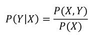

### 机器学习模式
机器学习模式其实是从已知的数据和答案中寻找出某种规则。也就是说，对机器学习而言，我们输入的是数据及其对应的答案，而寻找的是满足这样一种答案的数据背后的某种规则。

学术一点来讲，机器学习的特点就是：以计算机为-- 工具和平台，
以数据为-- 研究对象，以学习方法为-- 中心，是概率论、线性代数、信息
论、最优化理论和计算机科学等多个领域的交叉学科。

机器学习的研究一般包括 机器学习方法、机器学习理论、机器学习应用三个方面：  
（1）机器学习方法的研究旨在：开发新的学习方法。  
（2）机器学习理论的研究旨在于：探求机器学习方法的有效性和效率。  
（3）机器学习应用的研究主要考虑：将机器学习模型应用到实际问题中去，解决实际业务问题。  

## 机器学习分类

机器学习的分类方式有很多种，最常见的方式是按任务类型分类和按学习方式分类

### 按任务类型分类
* 按任务类型分类，机器学习可分为回归问题、分类问题、聚类问题和降维问题等
    * 回归问题其实就是利用数理统计中的回归分析技术，来确定两种或两种以上变量之间依赖关系。
    * 分类问题是机器学习中最常见的一类任务，比如我们常说的图像分类、文本分类等
    * 聚类问题又称群分析，目标是将样本划分为紧密关系的子集或簇。
    * 降维是指采用某种映射方法，将原高维空间中的数据点映射到低
    维空间。为什么使用降维呢？可能是原始高维空间中包含冗余信息或
    噪声，需要通过降维将其消除；也可能是某些数据集的特征维度过
    大，训练过程比较困难，需要通过降维来减少特征的量

        常用的降维模型有主成分分析（PCA）和线性判别分析（LDA）等

### 按学习方式分类
* 按学习方式来分类，机器学习可分为有监督学习、无监督学习和强化学习等

    * 有监督学习（Suprevised Learning）

        有监督学习（Suprevised Learning），简称监督学习，是指基于
一组带有结果标注的样本训练模型，然后用该模型对新的未知结果的
样本做出预测。

        通俗点讲就是利用训练数据学习得到一个将输入映射
到输出的关系映射函数，然后将该关系映射函数使用在新实例上，得
到新实例的预测结果。

        常见的监督学习任务是分类（Classify）和回归（Regression）

    * 无监督学习

        在无监督学习（Unsuprevised Learning）中，训练样本的结果信
息是没有被标注的，即训练集的结果标签是未知的。

        我们的目标是通过对这些无标记训练样本的学习来揭示数据的内在规律，发现隐藏在
数据之下的内在模式，为进一步的数据处理提供基础

        此类学习任务中比较常用的就是[聚类（Clustering）](./概念.md/#聚类)和[降维（Dimension Reduction）](./概念.md/#降维)。

    * 强化学习

        强化学习（Reinforcement Learning）又称再励学习、评价学
习，是从动物学习、参数扰动自适应控制等理论发展而来的。它把学
习过程看作一个试探评价过程

### 生成模型与判别模型
在有监督学习中，学习方法可进一步划分为生成方法和判别方法，所学到的模型对应称为生成模型和判别模型

* 生成模型  
    生成方法是由数据学习训练集的联合概率分布P（X,Y），然后求
出条件概率分布P（Y|X）作为预测的模型，即做成模型再运用这个模
型对测试集数据进行预测，即

    

    这样的方法之所以被称为生成方法，是因为模型表示了给定输入X
产生输出Y的生成关系。

    典型的生成模型有：朴素贝叶斯模型和隐马尔
科夫模型。

* 判别模型

    判别方法是由数据直接学习决策函数f（X）或条件概率分布P
（X,Y）作为预测模型，即判别模型

    判别方法关心的是对给定的输入X，应该预测出什么样的输出Y。
典型的判别模型包括K近邻、感知机、决策树、Logistic回归、最大熵
模型、支持向量机、提升方法、条件随机场等

## 机器学习方法 -- 三要素

机器学习方法都是由模型、策略和算法三要素构成的，可以简单表示为：  
机器学习方法=模型+策略+算法

### 模型

### 策略
采取的策略是为模型定义一个“损失函数”（Loss Function）（也称作“风险函数”），该损失函数可用来描述每一次预测结果与真实结果之间的差异

常用的一些损失函数 及 对应运用场景:

* （1）0-1损失函数，在朴素贝叶斯模型的推导中会用到

* （2）绝对损失函数

    L（Y, f(X)）=|Y−f(X)|

* （3）平方损失函数，一般用于回归问题中

    L（Y, f(X)）=（Y−f(X)）2

* （4）指数损失函数，在 AdaBoost 模型的推导中会用到

    L（Y, f(X)）=e−Yf(X)

* （5）Hinge损失函数，是SVM模型的基础

    L（Y, f(X)）=max（0 ,1−Yf(X)）

* （6）对数损失函数，在Logistic回归模型的推导中会用到
    L（Y,P（Y|X））=−log P（Y|X）

### 算法

梯度法是求解无约束多元函数极值最早的数值方法，很多机器学习的常用算法都是以它
作为算法框架进行改进的，从而导出更为复杂的优化方法。

### 总结
机器学习方法从数学的角度来看其实就是：模型+策略+算法。

* 模型就是对一个实际业务问题进行建模，将其转化为一个可以用数学来量化表达的问题。
* 策略就是定义损失函数来描述预测值与理论值之间的差距，将其转化为一个使损失函数最小化的优化题。
* 算法指的是求解最优化问题的方法，我们一般将其转化
为无约束优化问题，然后利用梯度下降法和牛顿法等进行求解
